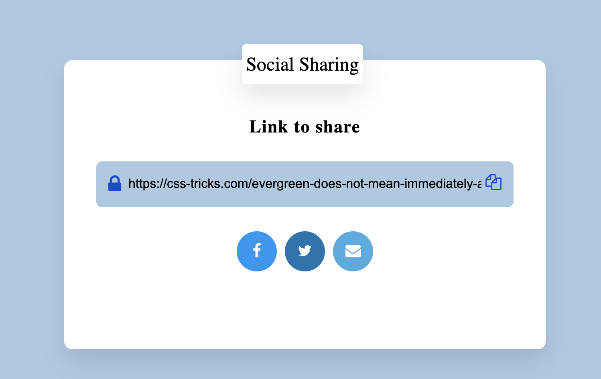

# social-share-js
social share url's
Intent is to js wrapper for social sharing integrations.

## Local development
 -[x] copy the link ability added

```
 npm i
 node index.js
 http://localhost:3000/
```

